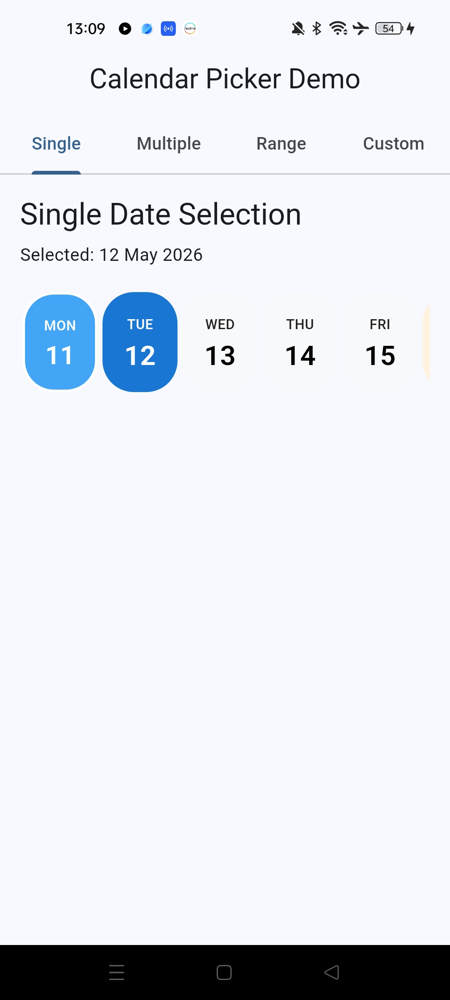
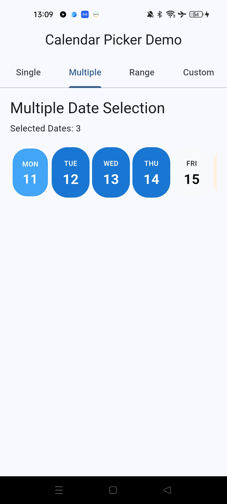
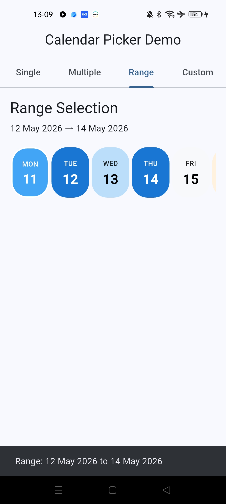
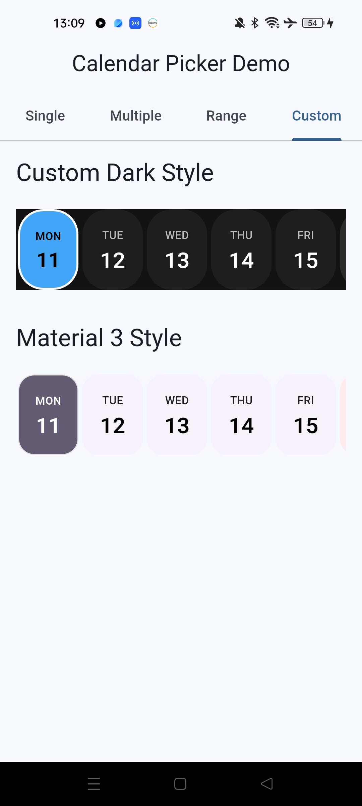

# CalendarPicker

[](https://pub.dartlang.org/packages/calender_picker)
[](https://opensource.org/licenses/MIT)
[](https://flutter.dev/)

A modern, customizable Flutter calendar picker with horizontal timeline, single/multi-date selection, date ranges, and extensive customization options for 2026 Flutter standards.

## ✨ Features

- **Horizontal Timeline Calendar** - Smooth horizontal scrolling calendar
- **Multiple Selection Modes** - Single, multiple, and range date selection
- **Date Restrictions** - Min/Max dates, disabled dates, blackout dates
- **Visual Enhancements** - Today highlighting, weekend highlighting
- **Infinite Scrolling** - Optional infinite horizontal scrolling
- **Swipe Navigation** - Touch-friendly navigation
- **Custom First Day of Week** - Configurable week start
- **Full Customization** - Colors, typography, spacing, decorations
- **RTL Support** - Right-to-left language support
- **Full Locale Support** - Internationalization ready
- **Accessibility** - Screen reader support, keyboard navigation
- **Material 3 Support** - Modern design system integration
- **Dark Mode** - Built-in dark theme support
- **Performance Optimized** - Smooth scrolling, efficient rendering

## 📸 Screenshots

| Single Selection | Multiple Selection | Date Range | Custom Styling |
|------------------|-------------------|------------|----------------|
|||||

## 🚀 Quick Start

### Installation

Add to your `pubspec.yaml`:

```yaml
dependencies:
  calender_picker: ^3.0.0
```

### Basic Usage

```dart
import 'package:calender_picker/calender_picker.dart';

CalendarPicker(
  selectionMode: CalendarSelectionMode.single,
  onDateSelected: (date) {
    print('Selected: $date');
  },
)
```

## 📖 Usage Examples

### Single Date Selection

```dart
CalendarPicker(
  selectionMode: CalendarSelectionMode.single,
  initialSelection: CalendarSelection.single(DateTime.now()),
  config: const CalendarConfig(
    locale: 'en_US',
    highlightToday: true,
    highlightWeekends: true,
  ),
  onDateSelected: (date) {
    print('Selected date: $date');
  },
)
```

### Multiple Date Selection

```dart
CalendarPicker(
  selectionMode: CalendarSelectionMode.multiple,
  config: const CalendarConfig(
    activeDates: [DateTime(2024, 1, 15), DateTime(2024, 1, 20)],
  ),
  onDatesSelected: (dates) {
    print('Selected dates: $dates');
  },
)
```

### Date Range Selection

```dart
CalendarPicker(
  selectionMode: CalendarSelectionMode.range,
  config: const CalendarConfig(
    minDate: DateTime(2024, 1, 1),
    maxDate: DateTime(2024, 12, 31),
  ),
  onRangeSelected: (start, end) {
    if (start != null && end != null) {
      print('Selected range: $start to $end');
    }
  },
)
```

### Custom Styling

```dart
CalendarPicker(
  style: CalendarStyle(
    selectedColor: Colors.blue,
    todayColor: Colors.orange,
    weekendColor: Colors.red.shade100,
    selectedTextStyle: const TextStyle(
      color: Colors.white,
      fontWeight: FontWeight.bold,
    ),
  ),
  onDateSelected: (date) {
    // Handle selection
  },
)
```

### Dark Mode

```dart
CalendarPicker(
  style: CalendarStyle.dark(),
  // ... other properties
)
```

### Material 3

```dart
CalendarPicker(
  style: CalendarStyle.material3(),
  // ... other properties
)
```

### Using Controller

```dart
class MyWidget extends StatefulWidget {
  @override
  _MyWidgetState createState() => _MyWidgetState();
}

class _MyWidgetState extends State<MyWidget> {
  final CalendarController _controller = CalendarController();

  @override
  Widget build(BuildContext context) {
    return Column(
      children: [
        CalendarPicker(
          controller: _controller,
          selectionMode: CalendarSelectionMode.multiple,
        ),
        ElevatedButton(
          onPressed: () {
            _controller.clearSelection();
          },
          child: const Text('Clear Selection'),
        ),
      ],
    );
  }

  @override
  void dispose() {
    _controller.dispose();
    super.dispose();
  }
}
```

## 🎨 Customization

### CalendarConfig

```dart
CalendarConfig(
  startDate: DateTime.now(),
  minDate: DateTime(2024, 1, 1),
  maxDate: DateTime(2024, 12, 31),
  disabledDates: [DateTime(2024, 1, 15)],
  activeDates: [DateTime(2024, 1, 20)],
  firstDayOfWeek: 1, // Monday
  locale: 'en_US',
  enableInfiniteScroll: true,
  daysCount: 365,
  highlightToday: true,
  highlightWeekends: true,
  enableSwipeNavigation: true,
  showMonthHeaders: true,
  height: 80,
  itemWidth: 60,
  itemSpacing: 4,
)
```

### CalendarStyle

```dart
CalendarStyle(
  // Colors
  backgroundColor: Colors.white,
  selectedColor: Colors.blue,
  todayColor: Colors.orange,
  weekendColor: Colors.red.shade100,
  disabledColor: Colors.grey.shade300,

  // Text styles
  dayTextStyle: const TextStyle(fontSize: 11, fontWeight: FontWeight.w500),
  dateTextStyle: const TextStyle(fontSize: 24, fontSize: FontWeight.w600),
  monthTextStyle: const TextStyle(fontSize: 11, fontWeight: FontWeight.w500),

  // Decorations
  selectedDecoration: BoxDecoration(
    color: Colors.blue,
    borderRadius: BorderRadius.circular(25),
  ),

  // Spacing
  itemPadding: const EdgeInsets.all(8),
  itemBorderRadius: 25,
)
```

## 🔧 API Reference

### CalendarPicker

| Property | Type | Description |
|----------|------|-------------|
| `selectionMode` | `CalendarSelectionMode` | Selection mode (single/multiple/range) |
| `initialSelection` | `CalendarSelection?` | Initial selection state |
| `config` | `CalendarConfig` | Calendar configuration |
| `style` | `CalendarStyle?` | Visual styling |
| `controller` | `CalendarController?` | Optional controller |
| `onDateSelected` | `ValueChanged<DateTime>?` | Single date selection callback |
| `onDatesSelected` | `ValueChanged<List<DateTime>>?` | Multiple dates selection callback |
| `onRangeSelected` | `Function(DateTime?, DateTime?)?` | Range selection callback |
| `onMonthChanged` | `ValueChanged<DateTime>?` | Month change callback |
| `onDisabledDateTap` | `ValueChanged<DateTime>?` | Disabled date tap callback |

### CalendarController

| Method | Description |
|--------|-------------|
| `selectDate(DateTime)` | Select a single date |
| `toggleDate(DateTime)` | Toggle date in multi-selection |
| `selectDates(List<DateTime>)` | Set multiple dates |
| `selectRange(DateTime?, DateTime?)` | Set date range |
| `clearSelection()` | Clear all selections |
| `dispose()` | Dispose controller |

## 🌍 Localization

The package supports full internationalization:

```dart
CalendarPicker(
  config: const CalendarConfig(
    locale: 'es_ES', // Spanish
  ),
)
```

Supported locales depend on the `intl` package. Make sure to initialize date formatting:

```dart
import 'package:intl/date_symbol_data_local.dart';

void main() async {
  await initializeDateFormatting('es_ES', null);
  runApp(MyApp());
}
```

## ♿ Accessibility

The calendar includes comprehensive accessibility features:

- Screen reader support with descriptive labels
- Keyboard navigation
- High contrast support
- Semantic markup
- Focus management

## 🧪 Testing

Run tests:

```bash
flutter test
```

Run example app:

```bash
cd example
flutter run
```

## 📋 Migration Guide

### From v2.x to v3.0

1. **Update pubspec.yaml**:
   ```yaml
   dependencies:
     calender_picker: ^3.0.0
   ```

2. **Update imports**:
   ```dart
   // Old
   import 'package:calender_picker/calender_picker.dart';
   CalenderPicker(...)

   // New
   import 'package:calender_picker/calender_picker.dart';
   CalendarPicker(...)
   ```

3. **Update constructor**:
   ```dart
   // Old
   CalenderPicker(
     DateTime.now(),
     enableMultiSelection: true,
     onDateChange: (date) => print(date),
   )

   // New
   CalendarPicker(
     selectionMode: CalendarSelectionMode.multiple,
     onDatesSelected: (dates) => print(dates),
   )
   ```

4. **Update styling**:
   ```dart
   // Old
   CalenderPicker(
     selectionColor: Colors.blue,
     selectedTextColor: Colors.white,
   )

   // New
   CalendarPicker(
     style: const CalendarStyle(
       selectedColor: Colors.blue,
       selectedDayTextStyle: TextStyle(color: Colors.white),
       selectedDateTextStyle: TextStyle(color: Colors.white),
     ),
   )
   ```

## 🤝 Contributing

Contributions are welcome! Please:

1. Fork the repository
2. Create a feature branch
3. Make your changes
4. Add tests
5. Submit a pull request

## 📄 License

MIT License - see [LICENSE](LICENSE) file.

## 🙏 Acknowledgments

- Built with Flutter
- Uses `intl` for internationalization
- Inspired by modern calendar interfaces

---

Made with ❤️ for the Flutter community